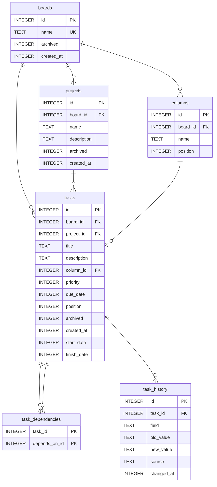

```mermaid
erDiagram
    boards ||--o{ projects : ""
    boards ||--o{ columns : ""
    boards ||--o{ tasks : ""
    projects ||--o{ tasks : ""
    columns ||--o{ tasks : ""
    tasks ||--o{ task_dependencies : ""
    tasks ||--o{ task_dependencies : ""
    tasks ||--o{ task_history : ""

    boards {
        INTEGER id PK
        TEXT name UK
        INTEGER archived
        INTEGER created_at
    }

    projects {
        INTEGER id PK
        INTEGER board_id FK
        TEXT name
        TEXT description
        INTEGER archived
        INTEGER created_at
    }

    columns {
        INTEGER id PK
        INTEGER board_id FK
        TEXT name
        INTEGER position
    }

    tasks {
        INTEGER id PK
        INTEGER board_id FK
        INTEGER project_id FK
        TEXT title
        TEXT description
        INTEGER column_id FK
        INTEGER priority
        INTEGER due_date
        INTEGER position
        INTEGER archived
        INTEGER created_at
        INTEGER start_date
        INTEGER finish_date
    }

    task_dependencies {
        INTEGER task_id PK
        INTEGER depends_on_id PK
    }

    task_history {
        INTEGER id PK
        INTEGER task_id FK
        TEXT field
        TEXT old_value
        TEXT new_value
        TEXT source
        INTEGER changed_at
    }

```
